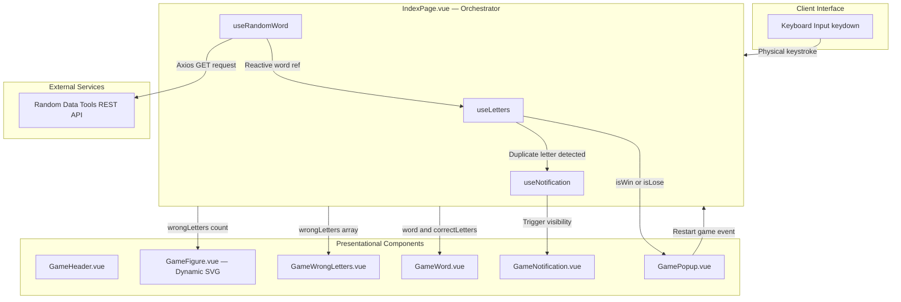

# GallowsGame — Modern Vue 3 & TypeScript Hangman Web Application

<p align="center">
  <a href="README.md"><b>English</b></a> | <a href="README.ru.md"><b>Русский</b></a>
</p>

<p align="center">
  
  
  
  
  
</p>

---

## Overview

**GallowsGame** is a responsive, type-safe implementation of the classic Hangman word-guessing game. Engineered with **Vue 3 Composition API**, **TypeScript**, and the **Quasar Framework**, this project showcases clean frontend architectural patterns: complete decoupling of business logic into reusable **Composables**, procedural **pure SVG dynamic rendering**, strict TypeScript contracts, and accessible UI interactions.

<p align="center">
  
</p>

---

## Architectural Highlights & Engineering Practices

### 1. Vue 3 Composition API & `<script setup lang="ts">`
- **Modern Syntax**: Built entirely with `<script setup lang="ts">`, delivering optimal compile-time performance, concise component code, and zero boilerplate.
- **Strict Typing**: TypeScript interfaces govern component contracts (`defineProps<Props>()`, `defineEmits<{...}>()`, and `defineExpose({...})`), providing end-to-end type safety across components.
- **Reactive State Flow**: Leverages `ref`, `computed`, and `watch` primitives to reactively synchronize game state without external state-management bloat.

### 2. Clean Separation of Concerns via Custom Composables
The game logic is fully separated from visual rendering into dedicated, testable composables in `src/composables/`:

| Composable | Responsibility | Key Mechanics |
| :--- | :--- | :--- |
| [`useLetters`](gallows_game/src/composables/useLetters.ts) | Core game rule engine & letter registry | Maintains guessed letters `ref<string[]>`. Calculates `correctLetters`, `wrongLetters`, `isLose` (6 failed attempts limit), and `isWin` via `computed()`. Validates Russian alphabet input via regex `/[а-яА-ЯёЁ]/`. |
| [`useRandomWord`](gallows_game/src/composables/useRandomWord.ts) | Asynchronous dictionary acquisition | Integrates with the [Random Data Tools API](https://randomdatatools.ru/developers/) via Axios to fetch random Russian words/names. Automatically queries on mount (`onMounted`). |
| [`useNotification`](gallows_game/src/composables/useNotification.ts) | Transient UI feedback manager | Controls temporary warning banners when a player inputs an already-guessed letter. Handles auto-dismiss timeouts cleanly. |

### 3. Procedural SVG Dynamic Rendering (`GameFigure.vue`)
- **Zero Raster Overhead**: The hangman gallows and figure are rendered entirely via declarative SVG vectors (`<svg>`, `<line>`, `<circle>`).
- **Reactive Vector State**: The 6 stages of the hangman figure (head, spine, left arm, right arm, left leg, right leg) are rendered conditionally based on `wrongLettersCount`:
  ```vue
  <!-- Dynamic SVG Hangman State -->
  <circle v-if="wrongLettersCount >= 1" cx="180" cy="75" r="25" />
  <line v-if="wrongLettersCount >= 2" x1="180" y1="100" x2="180" y2="150" />
  <line v-if="wrongLettersCount >= 3" x1="180" y1="120" x2="140" y2="100" />
  <line v-if="wrongLettersCount >= 4" x1="180" y1="120" x2="220" y2="100" />
  <line v-if="wrongLettersCount >= 5" x1="180" y1="150" x2="140" y2="200" />
  <line v-if="wrongLettersCount >= 6" x1="180" y1="150" x2="220" y2="200" />
  ```

### 4. Quasar Framework & User Experience
- **Fluid Layout**: Structured with `<q-page>` and Quasar's flexbox grid system (`column`, `flex-center`, `bg-grey-2`).
- **Modal Dialogs**: `<q-dialog>` with scale transition effects reveals game completion dialogs (`win` / `lose`) with immediate keyboard restart focus.
- **Global Keyboard Listener**: Captures physical keyboard inputs (`keydown`) globally with automated guards that block further input upon game completion.

---

## Component Architecture & State Flow



---

## Project Structure

```
gallowsGame/
├── README.md                          # English documentation
├── README.ru.md                       # Russian documentation
└── gallows_game/                      # Quasar application root
    ├── index.html                     # Single-page application entrypoint
    ├── package.json                   # Dependencies & build scripts
    ├── quasar.config.js               # Quasar framework & Vite configuration
    ├── tsconfig.json                  # TypeScript compiler settings
    └── src/
        ├── App.vue                    # Root Vue component with router-view
        ├── api/
        │   └── getRandomName.ts       # Axios API client
        ├── components/
        │   ├── GameFigure.vue         # Pure SVG vector hangman renderer
        │   ├── GameHeader.vue         # Title and instructional header
        │   ├── GameNotification.vue   # Duplicate character warning toast
        │   ├── GamePopup.vue          # Win/Loss modal with Quasar Dialog
        │   ├── GameWord.vue           # Masked word letter slots
        │   └── GameWrongLetters.vue   # Incorrect guesses indicator
        ├── composables/
        │   ├── useLetters.ts          # Core state: inputs, win/loss, regex
        │   ├── useNotification.ts     # Transient notification lifecycle
        │   └── useRandomWord.ts       # Word acquisition & loading hook
        ├── pages/
        │   └── IndexPage.vue          # Main game orchestrator & event coordinator
        └── types/
            └── GameStatus.ts          # TypeScript type definitions ('win' | 'lose')
```

---

## Local Development & Setup

### Prerequisites
- **Node.js**: v18.x, v20.x, or newer
- **npm** (>= 6.13.4) or **yarn** (>= 1.21.1)

### Installation

1. **Clone the repository**:
   ```bash
   git clone https://github.com/KrayMakso68/gallowsGame.git
   cd gallowsGame/gallows_game
   ```

2. **Install project dependencies**:
   ```bash
   npm install
   ```

3. **Start the local development server (with HMR)**:
   ```bash
   npm run dev
   ```
   *or via Quasar CLI directly:*
   ```bash
   npx quasar dev
   ```

4. **Access the application**:
   Open your browser and navigate to `http://localhost:9000`.

### Production Build

To compile and bundle the application for production deployment:
```bash
npm run build
```
*or:*
```bash
npx quasar build
```
Production assets will be emitted to `dist/spa/`.

---

## Tech Stack Summary

- **Framework**: [Vue 3](https://vuejs.org/) (Composition API, `<script setup lang="ts">`)
- **Language**: [TypeScript](https://www.typescriptlang.org/)
- **UI Kit**: [Quasar Framework v2](https://quasar.dev/)
- **Build Engine**: [Vite](https://vitejs.dev/)
- **HTTP Client**: [Axios](https://axios-http.com/)
- **External Word Service**: [Random Data Tools API](https://randomdatatools.ru/developers/)

---

## Author

- **Maksim** — [@KrayMakso68](https://github.com/KrayMakso68)
