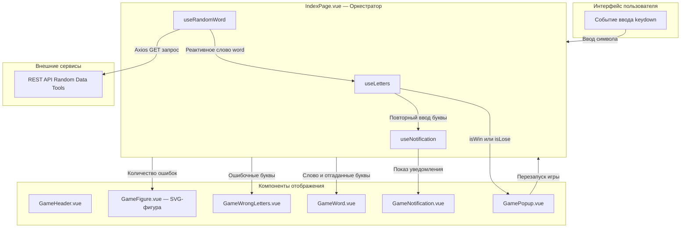

# GallowsGame — Веб-игра «Виселица» на Vue 3 и TypeScript

<p align="center">
  <a href="README.md"><b>English</b></a> | <a href="README.ru.md"><b>Русский</b></a>
</p>

<p align="center">
  
  
  
  
  
</p>

---

## Обзор проекта

**GallowsGame** — адаптивная и типобезопасная реализация классической игры в слова «Виселица». Проект спроектирован на базе **Vue 3 Composition API**, **TypeScript** и фреймворка **Quasar**. Архитектура проекта демонстрирует передовые практики современной фронтенд-разработки: полное отделение бизнес-логики в изолированные переиспользуемые функции (**Composables**), процедурный **динамический рендеринг pure SVG** без использования тяжелых растровых изображений или сторонних canvas-библиотек, строгую контрактную типизацию и доступный интерфейс.

<p align="center">
  
</p>

---

## Архитектурные решения и инженерные практики

### 1. Vue 3 Composition API & `<script setup lang="ts">`
- **Современный синтаксис**: Все компоненты реализованы с использованием декларативного `<script setup lang="ts">`, обеспечивающего высокую скорость компиляции, читаемость и отсутствие шаблонного кода (boilerplate).
- **Строгая типизация**: Контракты компонентов стандартизированы через интерфейсы TypeScript (`defineProps<Props>()`, `defineEmits<{...}>()`, `defineExpose({...})`), гарантируя сквозную типобезопасность на этапе компиляции.
- **Декларативная реактивность**: Использование примитивов `ref`, `computed` и `watch` позволяет реактивно синхронизировать состояние игры без необходимости подключения громоздких внешних стейт-менеджеров.

### 2. Разделение ответственности через кастомные Composables
Вся игровая механика вынесена из слоя представления в модульные, изолированные композиционные функции в папке `src/composables/`:

| Composable | Назначение | Ключевая механика |
| :--- | :--- | :--- |
| [`useLetters`](gallows_game/src/composables/useLetters.ts) | Игровой движок и реестр букв | Управляет реактивным массивом введенных букв `ref<string[]>`. Вычисляет через `computed()` множества `correctLetters`, `wrongLetters`, флаги окончания игры `isLose` (порог в 6 ошибок) и `isWin`. Фильтрует ввод через регулярное выражение кириллицы `/[а-яА-ЯёЁ]/`. |
| [`useRandomWord`](gallows_game/src/composables/useRandomWord.ts) | Асинхронное получение загаданного слова | Интегрируется с внешним API [Random Data Tools](https://randomdatatools.ru/developers/) через HTTP-клиент Axios. Запрашивает новое слово при монтировании компонента (`onMounted`). |
| [`useNotification`](gallows_game/src/composables/useNotification.ts) | Контроллер всплывающих уведомлений | Управляет отображением временного предупреждающего баннера при попытке повторного ввода уже названной буквы. Автоматически скрывает баннер по таймауту. |

### 3. Процедурный динамический SVG-рендеринг (`GameFigure.vue`)
- **Нулевой оверхед растровой графики**: Стойка виселицы и фигура человечка визуализируются исключительно средствами векторных SVG-примитивов (`<svg>`, `<line>`, `<circle>`).
- **Реактивное состояние виселицы**: 6 анатомических элементов фигуры (голова, туловище, левая/правая рука, левая/правая нога) отображаются пошагово в зависимости от счетчика допущенных ошибок `wrongLettersCount`:
  ```vue
  <!-- Процедурный SVG-рендеринг состояния виселицы -->
  <circle v-if="wrongLettersCount >= 1" cx="180" cy="75" r="25" />
  <line v-if="wrongLettersCount >= 2" x1="180" y1="100" x2="180" y2="150" />
  <line v-if="wrongLettersCount >= 3" x1="180" y1="120" x2="140" y2="100" />
  <line v-if="wrongLettersCount >= 4" x1="180" y1="120" x2="220" y2="100" />
  <line v-if="wrongLettersCount >= 5" x1="180" y1="150" x2="140" y2="200" />
  <line v-if="wrongLettersCount >= 6" x1="180" y1="150" x2="220" y2="200" />
  ```

### 4. Quasar Framework и интерфейс
- **Адаптивная верстка**: Построена на базе `<q-page>` и гибкой сетки Quasar flexbox (`column`, `flex-center`, `bg-grey-2`).
- **Модальные окна**: Компонент `<q-dialog>` с анимацией масштабирования (`scale`) отображает финальный экран (`победа` / `поражение`) с фокусом на кнопке перезапуска.
- **Глобальный перехват клавиатуры**: Слушатель события `keydown` на объекте `window` обрабатывает нажатия физической клавиатуры с блокировкой ввода после завершения партии.

---

## Архитектура компонентов и поток данных



---

## Структура проекта

```
gallowsGame/
├── README.md                          # Документация на английском языке
├── README.ru.md                       # Документация на русском языке
└── gallows_game/                      # Корневая директория приложения Quasar
    ├── index.html                     # Главная страница SPA
    ├── package.json                   # Зависимости и скрипты сборки
    ├── quasar.config.js               # Конфигурация Quasar и плагинов Vite
    ├── tsconfig.json                  # Параметры компилятора TypeScript
    └── src/
        ├── App.vue                    # Корневой Vue-компонент с router-view
        ├── api/
        │   └── getRandomName.ts       # Клиент Axios для запросов к словарному API
        ├── components/
        │   ├── GameFigure.vue         # Процедурный SVG-рендеринг виселицы
        │   ├── GameHeader.vue         # Заголовок и правила игры
        │   ├── GameNotification.vue   # Всплывающее предупреждение о повторе
        │   ├── GamePopup.vue          # Модальное окно победы/поражения (<q-dialog>)
        │   ├── GameWord.vue           # Блоки отображения отгадываемого слова
        │   └── GameWrongLetters.vue   # Блок списка ошибочно введенных букв
        ├── composables/
        │   ├── useLetters.ts          # Логика игры: реестр ввода, валидация, победа/поражение
        │   ├── useNotification.ts     # Жизненный цикл всплывающего уведомления
        │   └── useRandomWord.ts       # Хук получения случайного слова через API
        ├── pages/
        │   └── IndexPage.vue          # Главная страница, связывающая состояние и UI
        └── types/
            └── GameStatus.ts          # Определение типов TypeScript ('win' | 'lose')
```

---

## Локальный запуск и разработка

### Системные требования
- **Node.js**: версии 18.x, 20.x или выше
- **npm** (>= 6.13.4) или **yarn** (>= 1.21.1)

### Инструкция по установке

1. **Клонируйте репозиторий**:
   ```bash
   git clone https://github.com/KrayMakso68/gallowsGame.git
   cd gallowsGame/gallows_game
   ```

2. **Установите зависимости**:
   ```bash
   npm install
   ```

3. **Запустите сервер разработки (с поддержкой HMR)**:
   ```bash
   npm run dev
   ```
   *или напрямую через Quasar CLI:*
   ```bash
   npx quasar dev
   ```

4. **Откройте приложение в браузере**:
   Перейдите по адресу `http://localhost:9000`.

### Сборка для production

Для создания оптимизированного production-бандла:
```bash
npm run build
```
*или:*
```bash
npx quasar build
```
Скомпилированные статические файлы будут сохранены в папку `dist/spa/`.

---

## Стек технологий

- **Фреймворк**: [Vue 3](https://vuejs.org/) (Composition API, `<script setup lang="ts">`)
- **Язык**: [TypeScript](https://www.typescriptlang.org/)
- **UI-библиотека**: [Quasar Framework v2](https://quasar.dev/)
- **Инструмент сборки**: [Vite](https://vitejs.dev/)
- **Сетевой клиент**: [Axios](https://axios-http.com/)
- **Внешний сервис слов**: [Random Data Tools API](https://randomdatatools.ru/developers/)

---

## Автор

- **Максим** — [@KrayMakso68](https://github.com/KrayMakso68)

